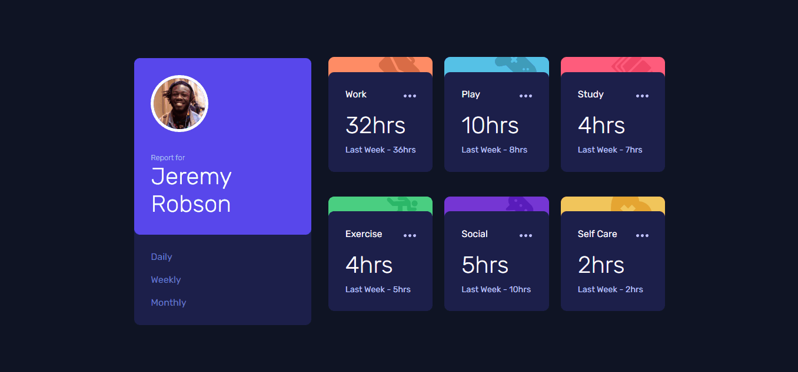
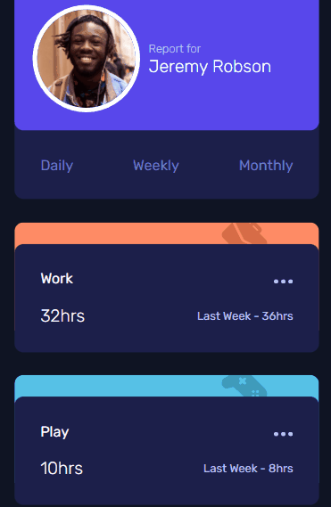

# Desafio Monitoramento de Tempo - Frontend-Mentor

Este é um desafio de monitoramento de tempo, proposto pelo site Frontend-Mentor.

## Tabela de Conteúdos

- [Visão Geral](#visão-geral)
    - [Imagens](#imagens)
    - [Link da página](#link)
- [Processo](#processo)
    - [Linguagens utilizadas](#linguagens-utilizadas)
    - [O que aprendi](#o-que-aprendi)
    - [Possíveis evoluções](#possíveis-evoluções)
- [Autor](#autor)

## Visão-geral

### Imagens

<br>

````
Versão de Desktop
````

   

<br>

````
Versão Mobile
````

 

### Link

- Página no GitHub Pages: <a href="https://julio-mansan2.github.io/monitoramento-de-tempo/">Clique aqui!</a>

## Processo

### Linguagens utilizadas

<br>

- Marcações semânticas de HTML5
- Propriedades de customização do CSS3
- Estruturas em JavaScript

<br>

### O que aprendi

<br>

- Alterar as classes entre elementos

````html

<div>
    <label class="daily-label" for="daily">Daily</label>
    <input type="radio" name="option[365]" id="daily">
</div>

<h1 class="selecionado weekly">32hrs</h1>
<h1 class="daily">8hrs</h1>
<h1 class="monthly">128hrs</h1>

````
````javascript

const dailyInput = document.getElementById('daily')
const weekStats = document.querySelectorAll('.weekly')
const dayStats = document.querySelectorAll('.daily')
const monthStats = document.querySelectorAll('.monthly')
const dailyLabel = document.querySelector('.daily-label')
const weeklyLabel = document.querySelector('.weekly-label')
const monthlyLabel = document.querySelector('.monthly-label')

dailyInput.addEventListener('click', function () {
    for (let i = 0; i < dayStats.length; i++) {
        if (dailyInput.checked) {
            dayStats[i].classList.add('selecionado')
            weekStats[i].classList.remove('selecionado')
            monthStats[i].classList.remove('selecionado')
            dailyLabel.classList.add('checked')
            weeklyLabel.classList.remove('checked')
            monthlyLabel.classList.remove('checked')
        }
    }
})

````
<br>

### Possíveis evoluções

<br>

- Códigos mais compactos;
- Utilizar o arquivo JSON.

<br>

## Autor

GitHub - <a href="https://github.com/julio-mansan2">julio-mansan2</a> <br>
Front-end Mentor - <a href="https://www.frontendmentor.io/profile/julio-mansan2">julio-mansan2</a> <br>
LinkedIn - <a href="https://www.linkedin.com/in/j%C3%BAlio-a-mansan-3415a7249/">Júlio A.</a> <br>